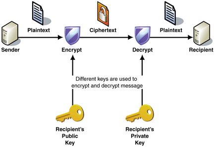

# KriptaRSA

## Representation

## Purpose

This module have the main purpose to perform an asymmetric (RSA standing for `Rivest–Shamir–Adleman` encryption) communication between two peers.
The public-key to encrypt a message and the private to decrypt it.

## Features

- keyPairs generation(publicKey and privateKey).
- Encrypt message with public Key of the peer we want to send message to.
- Decrypt Message with private key encrypted by my public key.

NB: To get more information, contact the author.

## Author

- Sanix-darker(Ange SAA DJIO)