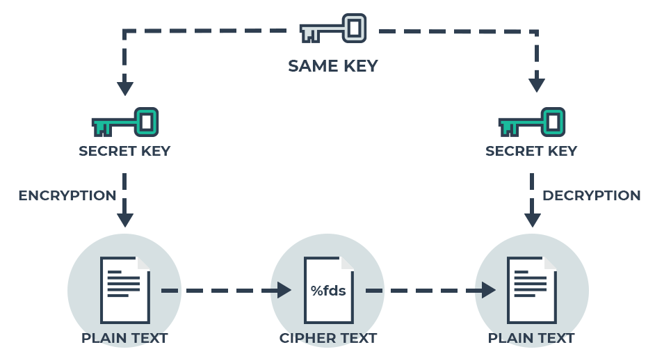

# KriptaAES

## Representation

## Purpose

This module have the main purpose to perform an Symmetric (AES standing for `The Advanced Encryption Standard` encryption) communication between two peers.
A unique Key is set to Encrypt and Decrypt a message in this communication.

## Features

- key generation.
- Encrypt message with the secret Key.
- Decrypt Message with the secret key.

NB: To get more information, contact the author.

## Author

- Sanix-darker(Ange SAA DJIO)